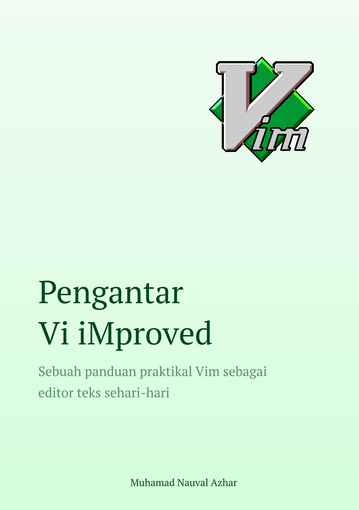

# Pengantar Vi iMproved

Pengantar Vi iMproved adalah buku yang ditujukan bagi mereka yang ingin mempelajari Vim sebagai pilihan alternatif editor teks. Dengan mempelajari Vim, kita akan dapat menyunting teks dengan lebih cepat dan efisien, dan memanfaatkan kekuatan editor tersebut untuk meningkatkan produktivitas.

> Kita perlu membiasakan mencoba alternatif lain untuk melihat potensi pengalaman yang lebih baik. Bukan menutup diri dengan berlagak konservatif.

## Unduh

[Pengantar Vi iMproved.pdf](https://github.com/nauvalazhar/pengantar-vi-improved/raw/main/Pengantar%20Vi%20iMproved.pdf)

## Cover

Desain *cover* resmi yang digunakan pada buku ini:

|  |  |
|---|---|

## Informasi Buku

Buku ini diterbitkan secara independen oleh Muhamad Nauval Azhar dengan rincian sebagai berikut:

|  Properti |  Nilai |
|---|---|
| Ukuran | **B5** (17,6 x 25,01 cm) |
| Berat | - |
| Jumlah Halaman | **226** |
| Tahun Terbit | **2022** |
| Penulis | Muhamad Nauval Azhar |
| Penerbit | Independen |

## Tentang Repository

*Repository* ini dibuat sebagai media pendistribusian buku dalam format PDF.

## Hak Cipta
**Pengantar Vi iMproved**

Hak Cipta © 2022 oleh Muhamad Nauval Azhar

Semua hak cipta untuk buku ini dimiliki oleh Muhamad Nauval Azhar. Buku ini diterbitkan secara independen oleh Muhamad Nauval Azhar. Segala bentuk penggandaan, penyebaran, atau penggunaan untuk tujuan komersial tanpa izin tertulis dari pengarang adalah dilarang.

Anda dapat mengunduh salinan buku ini untuk keperluan pribadi atau pendidikan, namun Anda tidak diizinkan untuk menjual atau mendistribusikan ulang salinan buku ini tanpa izin tertulis dari pengarang. Selain itu, Anda juga tidak diizinkan untuk memodifikasi, memperbanyak, atau menggunakan konten buku ini untuk tujuan komersial tanpa izin tertulis dari pengarang.

